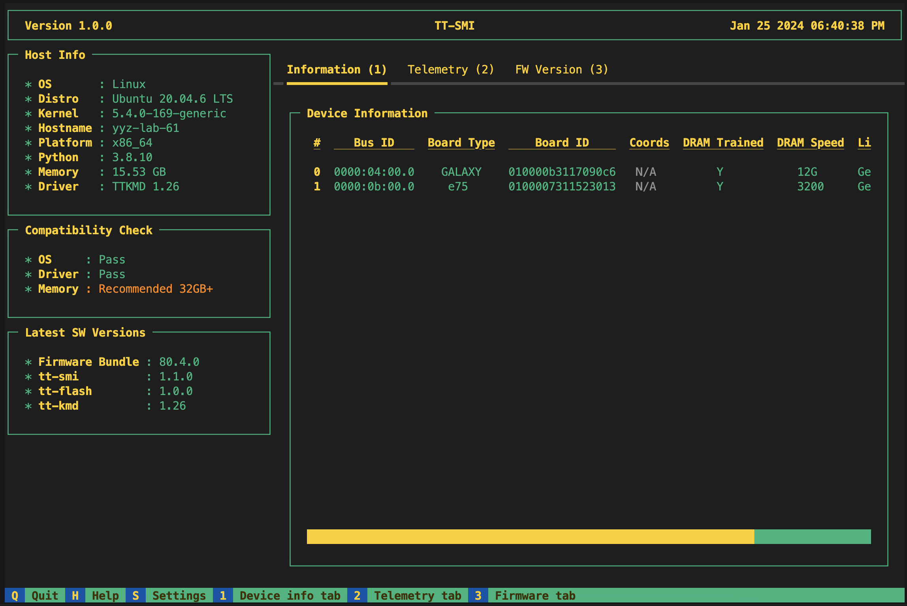
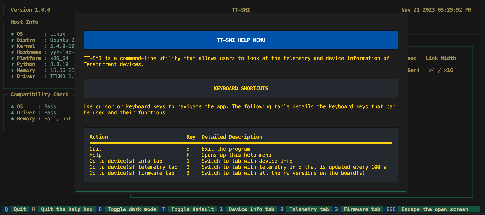

# TT-SMI

Tenstorrent System Management Interface (TT-SMI) is a command line utility
to interact with all Tenstorrent devices on host.

Main objective of TT-SMI is to provide a simple and easy to use interface
to collect and display device, telemetry and firmware information.

In addition user can issue Grayskull board tensix core reset.

# Getting started
Build and editing instruction are as follows -

### Building from Git

Install and source rust for the luwen library
```
curl --proto '=https' --tlsv1.2 -sSf https://sh.rustup.rs | sh
source "$HOME/.cargo/env"
```

### Optional 
Generate and source a python environment 
```
python3 -m venv .venv
source .venv/bin/activate
```
### Required
```
pip install .
```
for users who would like to edit the code without re-building
```
pip install --editable .
```

# Usage

Command line arguments
```
tt-smi [-h] [--local] [-v] [-s] [-ls] [-f [filename]] [-tr [TENSIX_RESET [TENSIX_RESET ...]]]
```
## Getting Help!

Running tt-smi with the ```-h, --help``` flag should bring up something that looks like this

```
$ tt-smi --help
    
    Gathering Information ━━━━━━━━━━━━━━━━━━━━━━━━━━━━━━━━━━━━━━━━ 100% 0:00:00
    usage: tt-smi [-h] [--local] [-v] [-s] [-ls] [-f [filename]] [-tr [TENSIX_RESET [TENSIX_RESET ...]]]

    Tenstorrent System Management Interface (TT-SMI) is a command line utility to interact with all Tenstorrent devices on host. Main objective of TT-SMI is to provide a simple and easy to use
    interface to collect and display device, telemetry and firmware information. In addition user can issue Grayskull and Wormhole board level resets.

    optional arguments:
    -h, --help            show this help message and exit
    --local               Run on local chips (Wormhole only)
    -v, --version         show program's version number and exit
    -s, --snapshot        Dump snapshot of current TT-SMI information to .json log. 
                          Default: ~/tt_smi/<timestamp>_snapshot.json User can use -f to change filename
    -ls, --list           List boards that are available on host and quits
    -f [filename], --filename [filename]
                          Change filename for test log. Default: ~/tt_smi/<timestamp>_snapshot.json
    -tr [TENSIX_RESET [TENSIX_RESET ...]], --tensix_reset [TENSIX_RESET [TENSIX_RESET ...]]
                          Grayskull only! Runs tensix reset on boards specified
```

Some of these flags will be discussed in more detail in the following sections.

## GUI
To bring up the tt-smi GUI run
```
$ tt-smi
```
This should bring up a display that looks as below. 



This is the default mode where user can see device information, telemetry and firmware.

### App keyboard shortcuts
All app keyboard shortcuts can be found in the help menu that user can bring up by hitting "h" or clicking the "help" button on the footer.



## Resets

Another feature of tt-smi is performing tensix core resets on Grayskull devices.

```
$ tt-smi -tr [TENSIX_RESET [TENSIX_RESET ...]], --tensix_reset [TENSIX_RESET [TENSIX_RESET ...]]
```
A successful reset should look something like the follows:

```
$ tt-smi -tr 0

    Gathering Information ━━━━━━━━━━━━━━━━━━━━━━━━━━━━━━━━━━━━━━━━ 100% 0:00:00
      Starting reset on board: 0 
      Lowering clks to safe value... 
      Beginning reset sequence... 
      Finishing reset sequence... 
      Returning clks to original values... 
      Finished reset on board: 0 
```
WARNING: this is only for Grayskull devices

In order to find the correct board index to call the reset on, the user can look at the GUI index or the desired device OR use the tt-smi board list function.
Board list should produce an output that looks like:
```
$ tt-smi -ls

    Gathering Information ━━━━━━━━━━━━━━━━━━━━━━━━━━━━━━━━━━━━━━━━ 100% 0:00:00
      All available boards on host: 
      0: <BOARD NUM> (grayskull - E75)
      1: <BOARD NUM> (grayskull - E75)
```

## Snapshots

TT-SMI provides an easy way to get all the information that is displayed on the GUI in a json file, using the ```-s, --snapshot``` argument. By default the file is named and stored as
``` ~/tt_smi/<timestamp>_snapshot.json```. User can also provide their own filename if desired, using the ```-f``` option

Example usage:
```
$ tt-smi -s -f tt_smi_example.json

    Gathering Information ━━━━━━━━━━━━━━━━━━━━━━━━━━━━━━━━━━━━━━━━ 100% 0:00:00
      Saved tt-smi log to: tt_smi_example.json 
```

## License

Apache 2.0 - https://www.apache.org/licenses/LICENSE-2.0.txt
